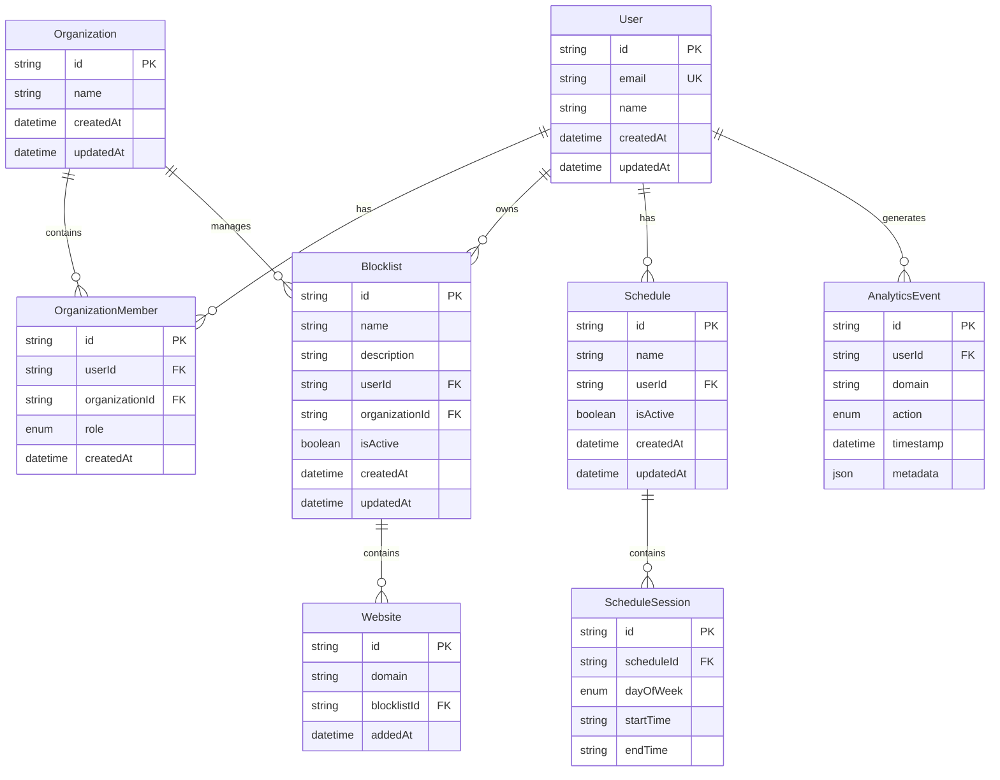

# Data Model: Website Blocker Extension

**Feature**: Website Blocker Extension  
**Created**: 2026-01-12  
**Phase**: 1 - Design & Contracts

## Entity Definitions

### User Entity
**Purpose**: Manages user accounts and authentication
```prisma
model User {
  id        String   @id @default(cuid())
  email     String   @unique
  name      String?
  createdAt DateTime @default(now())
  updatedAt DateTime @updatedAt
  
  // Relationships
  organizations   OrganizationMember[]
  blocklists     Blocklist[]
  schedules      Schedule[]
  analytics      AnalyticsEvent[]
  
  @@map("users")
}
```

**Validation Rules**:
- Email must be valid and unique
- Name is optional but max 255 characters
- CreatedAt/updatedAt automatically managed

### Organization Entity
**Purpose**: Groups users for shared blocking policies (future enhancement)
```prisma
model Organization {
  id        String   @id @default(cuid())
  name      String
  createdAt DateTime @default(now())
  updatedAt DateTime @updatedAt
  
  // Relationships
  members    OrganizationMember[]
  blocklists Blocklist[]
  
  @@map("organizations")
}

model OrganizationMember {
  id             String   @id @default(cuid())
  userId         String
  organizationId String
  role           MemberRole
  createdAt      DateTime @default(now())
  
  user         User         @relation(fields: [userId], references: [id], onDelete: Cascade)
  organization Organization @relation(fields: [organizationId], references: [id], onDelete: Cascade)
  
  @@unique([userId, organizationId])
  @@map("organization_members")
}

enum MemberRole {
  ADMIN
  MEMBER
}
```

### Blocklist Entity
**Purpose**: Defines collections of websites to block
```prisma
model Blocklist {
  id             String        @id @default(cuid())
  name           String
  description    String?
  userId         String?       // null for organization blocklists
  organizationId String?       // null for personal blocklists
  isActive       Boolean       @default(true)
  createdAt      DateTime      @default(now())
  updatedAt      DateTime      @updatedAt
  
  // Relationships
  user         User?         @relation(fields: [userId], references: [id], onDelete: Cascade)
  organization Organization? @relation(fields: [organizationId], references: [id], onDelete: Cascade)
  websites     Website[]
  
  // Constraints
  @@check(
    name: "owner_constraint",
    condition: (userId != null && organizationId == null) || (userId == null && organizationId != null)
  )
  @@map("blocklists")
}
```

**Validation Rules**:
- Name is required, max 255 characters
- Must belong to either user OR organization, not both
- Description optional, max 1000 characters

### Website Entity
**Purpose**: Individual websites or domains to block
```prisma
model Website {
  id          String   @id @default(cuid())
  domain      String   // e.g., "youtube.com", "*.reddit.com"
  blocklistId String
  addedAt     DateTime @default(now())
  
  // Relationships
  blocklist Blocklist @relation(fields: [blocklistId], references: [id], onDelete: Cascade)
  
  @@unique([domain, blocklistId])
  @@map("websites")
}
```

**Validation Rules**:
- Domain must be valid format (supports wildcards)
- Domain + blocklistId must be unique
- Domain normalization: lowercase, remove protocols

### Schedule Entity
**Purpose**: Time-based blocking rules
```prisma
model Schedule {
  id          String      @id @default(cuid())
  name        String
  userId      String
  isActive    Boolean     @default(true)
  createdAt   DateTime    @default(now())
  updatedAt   DateTime    @updatedAt
  
  // Relationships
  user      User            @relation(fields: [userId], references: [id], onDelete: Cascade)
  sessions  ScheduleSession[]
  
  @@map("schedules")
}

model ScheduleSession {
  id         String    @id @default(cuid())
  scheduleId String
  dayOfWeek  DayOfWeek
  startTime  String    // "09:00" format
  endTime    String    // "17:00" format
  
  // Relationships
  schedule Schedule @relation(fields: [scheduleId], references: [id], onDelete: Cascade)
  
  @@map("schedule_sessions")
}

enum DayOfWeek {
  MONDAY
  TUESDAY
  WEDNESDAY
  THURSDAY
  FRIDAY
  SATURDAY
  SUNDAY
}
```

**Validation Rules**:
- Times in HH:MM format, 24-hour
- EndTime must be after startTime
- No overlapping sessions for same schedule + day

### Analytics Entity
**Purpose**: Usage tracking and insights
```prisma
model AnalyticsEvent {
  id        String      @id @default(cuid())
  userId    String
  domain    String
  action    EventAction
  timestamp DateTime    @default(now())
  metadata  Json?       // Additional context
  
  // Relationships
  user User @relation(fields: [userId], references: [id], onDelete: Cascade)
  
  @@index([userId, timestamp])
  @@index([domain, timestamp])
  @@map("analytics_events")
}

enum EventAction {
  BLOCKED        // User attempted to access blocked site
  ALLOWED        // User accessed allowed site during blocking session
  SCHEDULE_START // Blocking schedule activated
  SCHEDULE_END   // Blocking schedule ended
  MANUAL_BYPASS  // User manually disabled blocking
}
```

**Validation Rules**:
- Timestamp indexed for time-series queries
- Metadata stored as JSON for flexibility
- Domain normalization consistent with Website entity

## Entity Relationships



## State Transitions

### Blocklist States
- **Draft**: User creating/editing (not synced to extension)
- **Active**: Published and enforced in extension
- **Inactive**: Temporarily disabled
- **Archived**: Soft deleted, kept for analytics

### Schedule States
- **Pending**: Scheduled but not yet active
- **Active**: Currently enforcing blocking rules
- **Completed**: Session ended naturally
- **Bypassed**: User manually disabled during session

## Data Access Patterns

### Extension Sync Patterns
```typescript
// Extension local storage schema
interface ExtensionData {
  user: { id: string; email: string };
  blocklists: BlocklistSummary[];
  activeSchedules: ScheduleSummary[];
  lastSync: string;
  pendingAnalytics: AnalyticsEvent[];
}
```

### API Query Patterns
- User blocklists: Filter by userId, include websites
- Organization policies: Join through OrganizationMember
- Schedule evaluation: Query by user + current time
- Analytics aggregation: Time-series grouping by day/hour